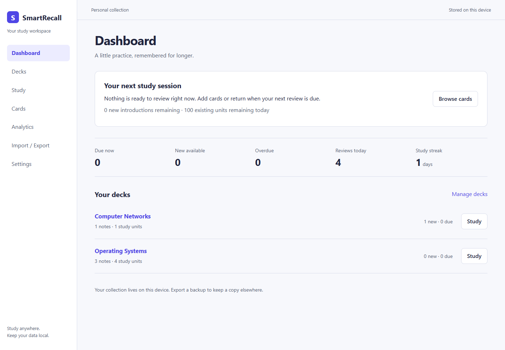
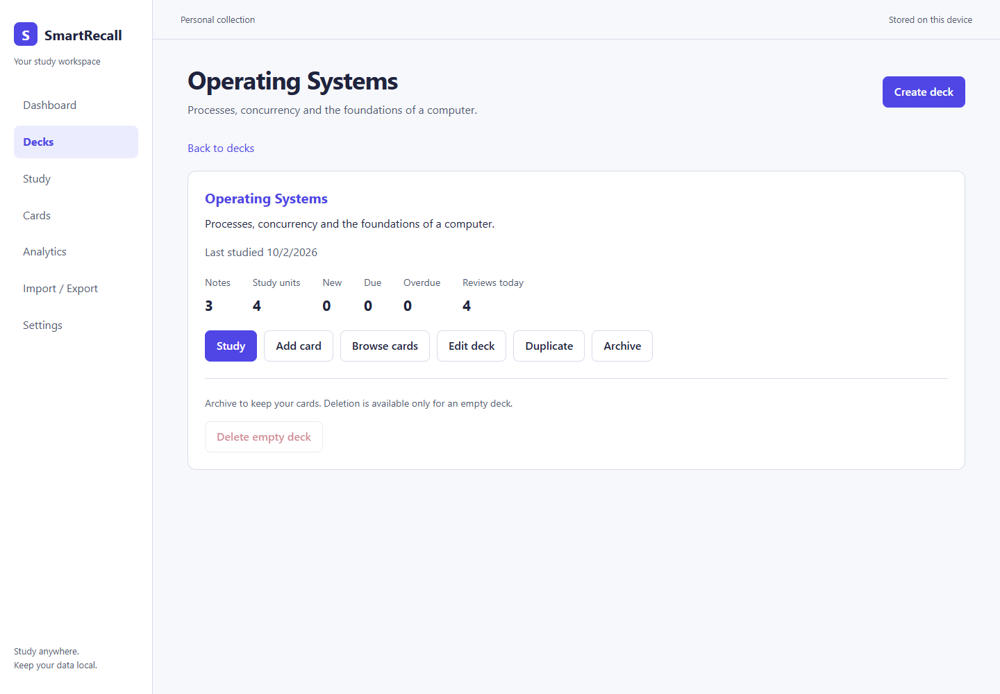
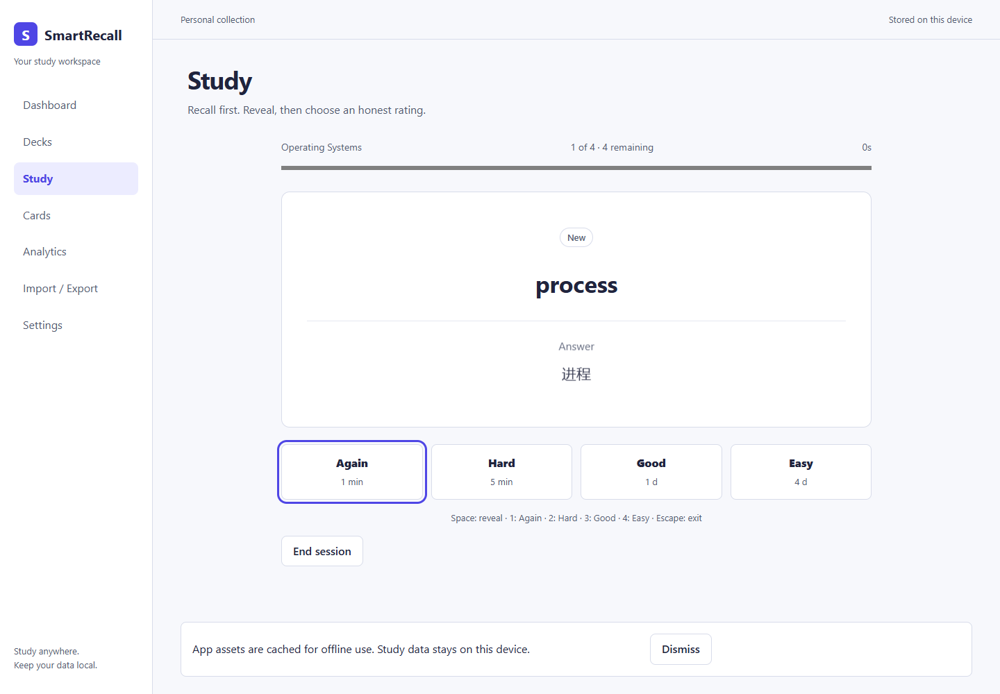
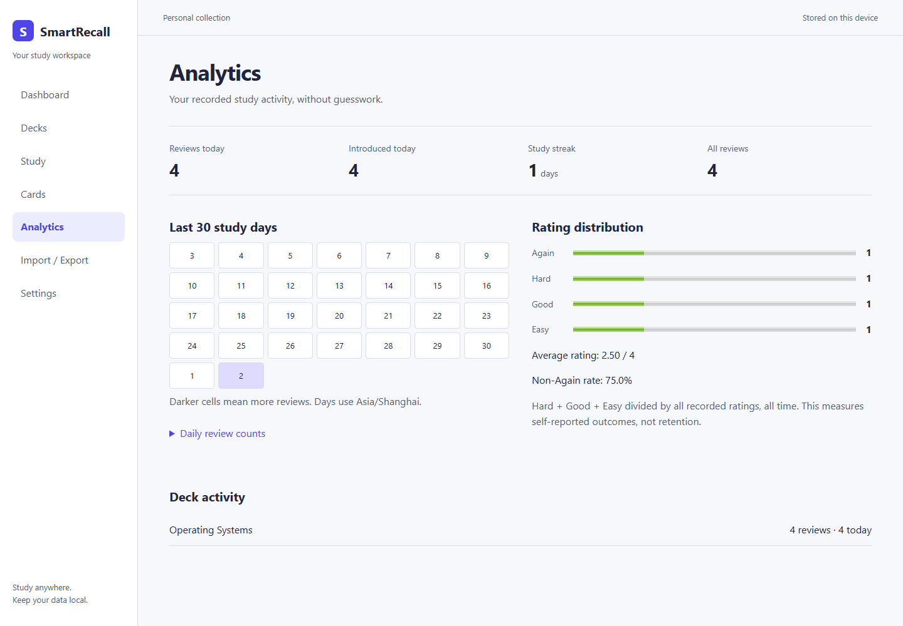
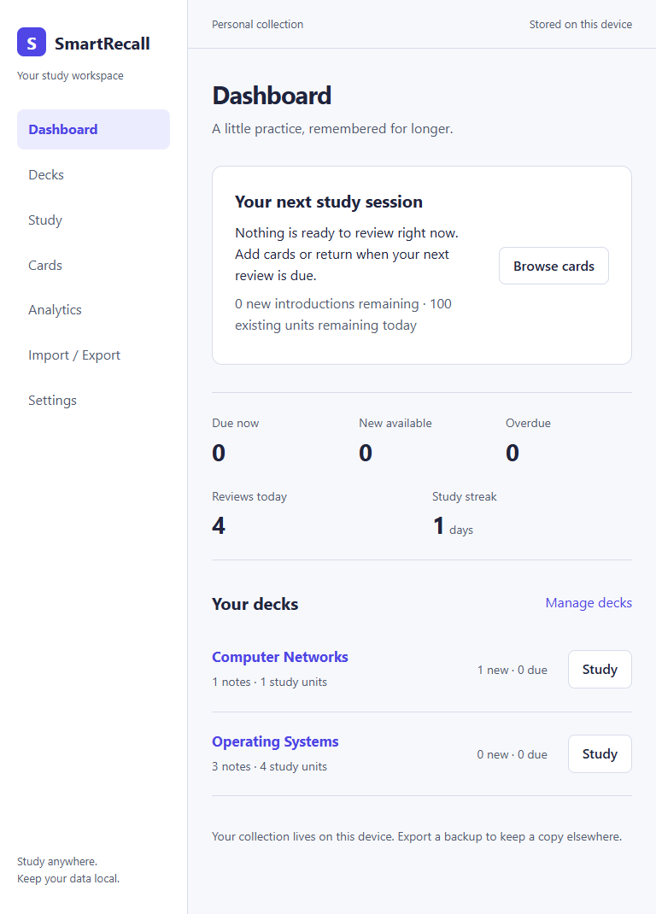
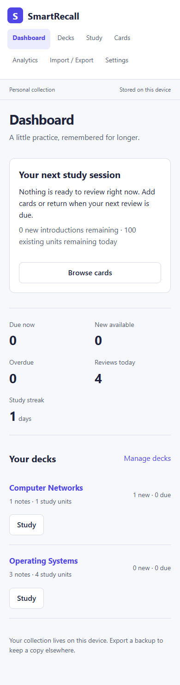

# SmartRecall

An offline-first React and TypeScript flashcard application with decks, typed notes, four-rating spaced repetition, data-preserving migrations, and study analytics.

## Overview

SmartRecall is a personal spaced-repetition study application extended from [Ali Sed's flashcard_react](https://github.com/alised/flashcard_react). Organize questions for a course or language, then study without an account, backend, or external AI service. Study data stays in the browser by default.

Dashboard, Decks, Study, Cards, Analytics, Import / Export, and Settings form the main workflows. The implementation emphasizes understandable algorithms, reliable local persistence, and honest statistics.

## Features

### Upstream foundation

The original project supplied React, TypeScript, Vite, Tailwind, Dexie/IndexedDB storage, routing, vocabulary CRUD and search, theme preferences, learning sessions, keyboard shortcuts, daily-new settings, JSON vocabulary import/export, basic Leitner scheduling, and Vite PWA configuration. These are inherited foundations.

### SmartRecall additions

- Domain modules separate note modeling, cloze parsing, scheduling, queues, and analytics from React views.
- Deck creation, rename, descriptions, archive/unarchive, duplication, and safe deletion of empty decks.
- Basic, Basic + Reverse, and Cloze notes with independently scheduled directions.
- Again, Hard, Good, and Easy ratings with a tested SM-2-inspired scheduler.
- Atomic schedule/event writes, stale-session protection, and visible persistence failures.
- Event-derived daily quotas, including failed first recalls and durable same-day retries.
- Normalized tags, text search, deck/type/state/status filters, and card suspension.
- Previewed notes, CSV, and legacy JSON imports; CSV export; complete JSON backups with additive restore.
- Explicit version-2 Dexie migration preserving original version-1 records and IDs.
- Event-derived activity, rating distribution, streaks, and a 30-day calendar.
- Labelled forms, native dialogs, focus restoration, guarded shortcuts, responsive screens, and explicit PWA update choices.
- Domain, database, component, and production-browser tests, plus a GitHub Actions quality workflow.

## Screenshots

These are real screenshots of the production build, captured during the deterministic browser acceptance workflow. The cards and activity belong to its isolated test collection; a fresh installation has no fabricated activity.








## Technology Stack

| Area                | Technology                                                |
| ------------------- | --------------------------------------------------------- |
| Interface           | React 19, TypeScript, React Router                        |
| Persistence         | Dexie 4 and IndexedDB                                     |
| Build and styles    | Vite 6, application CSS, inherited Tailwind 3             |
| Offline assets      | vite-plugin-pwa and Workbox                               |
| Testing             | Vitest, React Testing Library, fake-indexeddb, Playwright |
| Development runtime | Node.js 24.x and npm with the committed lockfile          |

No database server, authentication service, analytics endpoint, or AI API is required.

## Architecture

`src/domain` holds deterministic TypeScript functions and types. `src/db` declares the Dexie schema and migration. `src/services` coordinates validated writes and transactions. `AppProvider` subscribes to Dexie `liveQuery`; pages render the current snapshot and manage temporary UI state.

A rating must commit both its scheduling update and immutable review event before the session advances. Transactions recheck note/unit revisions, active state, due time, and quotas. Failed writes leave the same question and progress visible. See [Architecture](docs/ARCHITECTURE.md).

## Data Model

| Entity                | Purpose                                                                                                              |
| --------------------- | -------------------------------------------------------------------------------------------------------------------- |
| `Deck`                | Name, description, timestamps, and optional archive timestamp                                                        |
| `Card`                | A user's note: Basic/Reverse front and back, or Cloze text; deck, tags, suspension, and content revision             |
| `SchedulingUnit`      | One direction or cloze ID with due time, state, interval, ease, repetitions, lapses, introduction time, and revision |
| `ReviewEvent`         | One saved rating with timestamp, before/after scheduling values, introduction flag, and measured response duration   |
| `ApplicationSettings` | Global quotas, IANA study time zone, theme, shortcut hints, automatic answer display, and scheduler parameters       |
| Legacy `words`        | Original upstream records retained as a recovery archive                                                             |

New-model timestamps are numeric Unix milliseconds. Card IDs accept strings and numbers to preserve legacy keys exactly: numeric `1` and string `"1"` remain distinct. New records use generated string IDs. One note can own several study units without becoming several unrelated notes.

## Spaced Repetition

The scheduler implements a small SM-2-inspired policy; no scientific superiority is claimed. Every call receives an explicit timestamp. Default ease starts at `2.5` and is clamped to `1.3–3.0`. Let `I` be the previous interval in days and `E` the bounded ease before the rating. Whole-day intervals are rounded, with minimum 1 and default maximum 36,500 days.

| Rating | New, learning, or relearning unit | Graduated review unit                                                  |
| ------ | --------------------------------- | ---------------------------------------------------------------------- |
| Again  | Retry in 1 minute; ease −0.20     | Retry in 1 minute; ease −0.20; enter relearning and add one lapse      |
| Hard   | Retry in 5 minutes; ease −0.15    | `round(I × 1.2)` days; ease −0.15                                      |
| Good   | Graduate at 1 day                 | 6 days when prior repetitions ≤1; otherwise `round(max(I + 1, I × E))` |
| Easy   | Graduate at 4 days; ease +0.15    | `round(max(I + 1, I × E × 1.3))` days; ease +0.15                      |

Again resets repetitions to zero; graduation sets them to one, and subsequent non-Again review ratings increment them. Repeated learning failures do not add another lapse. Short steps store interval `0` and a due timestamp in minutes. Day intervals mean elapsed 24-hour periods; calendar categories and quotas use the study time zone.

Differences from canonical SM-2 include four explicit ratings, short learning steps, bounded ease, an Easy bonus, and lapse/relearning state. The UI derives next-interval labels from scheduler results.

## Card Types

- **Basic:** front → back; one note, one scheduling unit.
- **Basic + Reverse:** front → back and back → front; one note, two independent units.
- **Cloze:** `A semaphore provides {{c1::synchronization}}.` One unit per distinct positive marker ID; repeated `c1` markers hide together. Hints use `{{c1::answer::hint}}`.

Cloze is rendered as plain text. Invalid, empty, or nested markers are rejected. Tags are trimmed, lowercased, deduplicated, and sorted: `OS`, `os`, and `os` become `os`.

Editing retains matching direction/cloze-ID schedules. New directions start fresh; removed directions lose their current schedule while historical review events remain. Duplicated decks contain new IDs and fresh schedules.

## Daily Review Queue

Only active cards in unarchived decks with `due <= now` enter the queue.

| Category | Meaning                                                 |
| -------- | ------------------------------------------------------- |
| New      | Never introduced: state `new`                           |
| Learning | A due short learning or relearning step                 |
| Due      | A review unit due now on the current study calendar day |
| Overdue  | A review unit due before the current study calendar day |

Ordering is Learning, Overdue, Due, New; then due timestamp, note creation timestamp, and stable unit ID. Identical state and timestamps produce the same order.

Daily limits count **distinct scheduling units globally across decks**. New introductions and existing-unit reviews have separate quotas. The first committed rating introduces a unit even when rated Again. Further attempts that study day consume no extra place, while each attempt still creates an event. Learning retries become available when due, including after quotas are exhausted. Zero pauses first introductions/reviews in that category; already charged units may still retry.

Accounting uses persisted events and the selected IANA time zone. Refresh/reopening does not reset limits. A failed transaction creates no event and consumes no quota. Changing the study time zone deliberately recalculates day boundaries. Sessions snapshot the queue; short learning retries return through the next queue.

Dashboard Due now counts are before limits; New available and session-ready counts apply quotas. Note and study-unit totals are separate.

## Offline Storage

The `flashcardDB` IndexedDB database belongs to the current browser profile and origin. Different schemes, hosts, ports, and profiles have separate data. There is no automatic cloud sync.

Site-data clearing, profile removal, private-browsing cleanup, or storage eviction can remove the collection. Keep JSON backups outside the browser. Service-worker asset caching is separate from the study database.

## Database Migration

SmartRecall keeps the original database name and declares the v1 `words` schema before upgrading to v2. Populated databases become an **Imported Vocabulary** deck. Original records remain in `words`, including malformed fields and duplicate-looking notes. IDs, valid text, dates, and box intervals are retained where meaningful; box 6 becomes suspension.

No historical events are fabricated. Original `darkMode`, `dailyNewWords`, and `autoShowAnswer` preferences migrate once into IndexedDB; their localStorage keys remain untouched. Dexie's upgrade transaction runs independently of React, and reopening v2 does not repeat it.

Automatic migration requires the original origin/profile. See [Migration decisions and coverage](docs/MIGRATION.md).

## Import and Export

**Notes to cards** parses one record per line using `Term :: Definition`, `Question ? Answer`, or cloze syntax, without AI.

**CSV** requires `type,front,back` headers. Optional columns are `deck,text,tags`; types are `basic`, `reverse`, `cloze`; tags use semicolons. Quoted commas, escaped quotes, multiline cells, and Unicode are supported. New deck names appear in the preview. CSV export shares content and tags without review history.

**Vocabulary JSON (original app)** accepts the original simple/full arrays with `word` and `context`. Optional boxes and scheduling dates are validated; old IDs are not reused. Manual import creates fresh Basic notes with new IDs and new scheduling state; it does not restore old review history or schedules. This explicit content-transfer path differs from automatic same-origin v1 migration, which preserves usable schedules.

All content imports preview valid, invalid, and duplicate rows. Duplicate detection compares normalized content, card type, and destination deck, including same-batch duplicates. Choose **Skip duplicates** or **Keep both**. Invalid rows are reported and skipped after explicit confirmation; failed writes roll back the entire valid batch.

**Full JSON backups** include metadata, decks, notes, units, review events, preferences, and archived legacy records. Restore validates types, IDs, dates, tags, scheduler values, and note/unit/deck relationships before preview and confirmation. Restore is additive: identical records are skipped, new records are added, and changed records sharing an ID block the transaction. It does not silently replace current records. Preferences restore only into an empty collection; conflicts are rechecked at confirmation.

## Keyboard Shortcuts

| Key           | During study                                    |
| ------------- | ----------------------------------------------- |
| Space         | Reveal; a second press does not submit a rating |
| 1 / 2 / 3 / 4 | Again / Hard / Good / Easy                      |
| Escape        | Open the exit confirmation                      |

Ratings require reveal by default. Automatic answer display is an explicit setting. Shortcuts ignore inputs, textareas, selects, editable content, open dialogs, repeat events, and Ctrl/Alt/Meta combinations. Hints can be hidden.

## Analytics

Activity comes from persisted review events, including events for deleted notes/decks. Legacy schedules do not invent history.

- **Reviews today:** every saved rating on the configured study day, including repeats.
- **Introduced today:** distinct units with a first-rating event that day, including Again.
- **Study streak:** consecutive dates with reviews through today, or yesterday while today has none; zero after a missed day.
- **Rating distribution/average:** all recorded ratings, mapped Again=1, Hard=2, Good=3, Easy=4.
- **Non-Again rate:** `(Hard + Good + Easy) / all recorded ratings × 100`, over all recorded history. It represents self-reported outcomes; the app displays no retention or mastery estimate.
- **Activity calendar:** real counts for the last 30 study dates. Empty histories show zero/empty activity and undefined ratios as a dash.
- **Session summary:** saved submissions, elapsed time, rating counts, and session non-Again percentage. Response duration measures question display to submitted rating and can include idle time.

## Installation

Use **Node.js 24.x**; `.nvmrc` and `package.json` record the supported version. Use npm with the committed lockfile.

```bash
git clone https://github.com/guxinyihan/smart-recall.git
cd smart-recall
npm ci
npm run dev
```

Development uses port 4000. A modern browser needs IndexedDB, IANA time-zone support, and native dialogs. Offline startup additionally requires service workers on HTTPS or localhost.

## Development

```bash
npm run lint
npm test
npm run test:watch
npm run build
npm run preview
```

Optional formatting check: `npx prettier --check src docs README.md`.

Build performs TypeScript checking and generates production assets/service worker in `dist`. Serve at the site root with an `index.html` fallback for application routes. Subdirectory hosting requires coordinated Vite, router, manifest, and service-worker path changes.

## Testing

Vitest covers scheduler/cloze/queues/analytics, controlled clocks, time-zone rollover, migration, concurrency, rollback, import validation, backups, and component workflows. Each database test uses an isolated fake IndexedDB name. RTL uses roles/labels; its dialog shim is complemented by real-browser focus checks.

```bash
npm ci
npm run lint
npm test
npm run build
npm run test:e2e
```

E2E tests exercise the production build in isolated browser contexts on port 4175. The default uses installed Google Chrome; if unavailable, install with `npx playwright install chrome` or set `PLAYWRIGHT_CHANNEL` to an available channel. Build first.

GitHub Actions runs `npm ci`, lint, tests, and build on Node 24 for main-branch pushes and pull requests. A configured workflow alone does not prove a hosted run passed.

## PWA / Offline Usage

The inherited VitePWA setup is improved with a coherent manifest, local assets, navigation fallback, and explicit update UI. Normal study has no remote API dependency.

Initially load online and allow service-worker installation/caching to finish. The offline-ready notice reports cached app assets. Subsequent startup can work offline while those assets and local storage remain available; a first uncached visit needs connectivity. Verify against a production build on HTTPS or localhost.

Waiting updates offer **Update and reload** and **Later**. Save changes before accepting reload. Registration/update failures show feedback while preserving study data.

## Accessibility

The interface uses semantic controls, associated labels, named close actions, visible focus, live feedback, a skip link, and main-content focus after navigation. Native dialogs move focus after opening, cycle Tab/Shift+Tab within visible enabled controls, and support Escape cancellation; closing restores the launch control when connected. Study focuses reveal/rating actions and exposes progress and discoverable shortcuts.

Responsive layouts cover narrow deck/card lists, editors, study, analytics, and import previews. Component and browser checks do not establish compatibility with every browser or assistive-technology combination.

## Project Structure

```text
src/
  App.tsx              Routes, shell, theme, render-error boundary
  domain/cards/        Typed notes, factory, tags, cloze
  domain/decks/        Deck type
  domain/review/       Scheduler, events, queue, settings validation
  domain/analytics/    Event calculations
  domain/importExport/ Parsers, validation, complete backups
  db/                 Schema, migration, snapshots
  services/           Validated transactional writes
  contexts/           Reactive snapshot coordination
  hooks/              Clock updates
  components/         Dialogs, feedback, PWA updates
  pages/              Product workflows and component tests
  test/               Test setup
docs/                 Architecture, migration, design, baseline
e2e/                  Production-browser/offline checks
```

Collections/history load into memory with local filtering and scans. This suits personal, student-sized collections; large histories need pagination and indexed aggregation. There is no sync, account recovery, encrypted storage layer, or cross-device history.

## Roadmap

- Multiple-choice cards.
- Optional AI-assisted creation with a secure architecture, while normal study stays independent.
- Optional sync/shared decks.
- Pagination and indexed aggregates.
- Broader browser and assistive-technology coverage.

These are future directions, not released features.

## Acknowledgements

SmartRecall is an extended and substantially modified version of [alised/flashcard_react](https://github.com/alised/flashcard_react). The original repository provided the initial flashcard application and spaced-repetition foundation. Its complete 28-commit history through audited commit [`181ca58acc93238dc1b9192f04b33d4fa561a5af`](https://github.com/alised/flashcard_react/commit/181ca58acc93238dc1b9192f04b33d4fa561a5af) is preserved, followed by new SmartRecall development commits.

## License

MIT; see [LICENSE](LICENSE). The original notice remains intact: **Copyright (c) 2024 Ali Sed**. SmartRecall additions do not change the original authorship or attribution.
