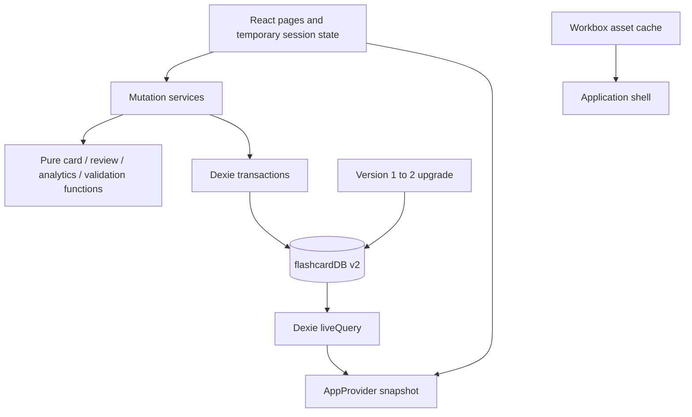

# SmartRecall architecture

SmartRecall extends an existing React vocabulary app into a local study platform. Browser storage and a small React application remain the foundation, while scheduling and data rules move out of the original all-purpose WordsContext.

## Boundaries

Cards, review, and analytics modules are independent of React and receive explicit data/timestamps. Import parsers and validation are pure functions. `domain/importExport/backup.ts` is intentionally persistence-facing: it coordinates database reads and restores, and could move to a service as its API grows.

`db/database.ts` declares schema and consistent read snapshots. Services own user-triggered writes. `AppProvider` initializes storage and subscribes to Dexie `liveQuery`. Pages keep transient filters, dialogs, previews, answer visibility, and current session state. There is no dependency-injection container, backend, mandatory AI, or extra state-management framework.

## Routes and source of truth

| Route                      | Workflow                                    |
| -------------------------- | ------------------------------------------- |
| `/`                        | Dashboard                                   |
| `/decks`, `/decks/:deckId` | Deck management/details                     |
| `/cards`                   | Notes, filters, editor                      |
| `/study`                   | Queue and rating session                    |
| `/analytics`               | Persisted event activity                    |
| `/import`                  | Content previews and backup import/export   |
| `/settings`                | Limits, time zone, theme, study preferences |

Original `/learn`, `/words`, `/database`, and `/help` URLs redirect to their replacement pages. Deck selection uses query parameters. Storage-startup and render failures show visible recovery actions without clearing data.

IndexedDB is the source of truth. Pages do not optimistically change schedules. A snapshot updates after committed writes. Session UI is not persisted: reload builds a fresh eligible queue while retaining committed reviews and quotas.

## Notes versus scheduling units

`Card` is a discriminated union: Basic/Reverse have `front/back`; Cloze has `text`. Common fields include deck, normalized tags, created/updated timestamps, suspension, and a monotonic content revision.

| Note            | Scheduling units                          |
| --------------- | ----------------------------------------- |
| Basic           | One forward direction                     |
| Basic + Reverse | Forward and reverse                       |
| Cloze           | One per distinct positive cloze marker ID |

Units store state, due timestamp, interval in days, ease, repetitions, lapses, introduction/last-review timestamps, and revision. Their IDs encode the note-ID type, escaped ID, direction, and optional cloze ID. Numeric `1`, string `"1"`, and opposite directions cannot collide.

Factories validate content and create consistent units. Cloze parsing rejects invalid/nested syntax, groups repeated IDs, supports hints, and renders plain text. Tags are trimmed, lowercased, deduplicated, and sorted.

Content edits preserve matching direction/ID schedules and increment their revisions. New directions start new; removed directions have no current schedule. Events remain historical. Note revisions prevent an old session from submitting against edited content, including a direction removed and later recreated at unit revision zero. Suspension changes also invalidate stale note snapshots. Deck duplicates create new IDs and fresh schedules without copied history.

## Dexie schema

Database name: `flashcardDB`. Version 1 remains declared; version 2 adds the new tables without removing `words`.

| Store      | Key and indexes                                             |
| ---------- | ----------------------------------------------------------- |
| `words`    | `++id, word, box, nextReview`                               |
| `decks`    | `id, name, archivedAt`                                      |
| `cards`    | `id, deckId, type, *tags, updatedAt`                        |
| `units`    | `id, cardId, deckId, due, state, [deckId+due]`              |
| `events`   | `id, unitId, cardId, deckId, timestamp, [deckId+timestamp]` |
| `settings` | `id`, one row keyed `app`                                   |

Timestamps are numeric Unix milliseconds. `null` means no introduction/review/archive; interval `0` denotes a short learning step. Numeric and string legacy keys survive. [MIGRATION.md](MIGRATION.md) explains conversion approximations and raw-record preservation.

## Review transaction

`submitReview` uses one read/write transaction over units, events, cards, decks, and settings:

1. Read the unit/note and reject missing data or mismatched expected revisions.
2. Read current decks, cards, settings, and events; rebuild eligibility at the supplied timestamp.
3. Reject inactive/suspended, not-due, or quota-excluded units.
4. Run the pure scheduler with persisted parameters.
5. Create an immutable event containing old/new state, interval, ease, due time, rating, introduction flag, and measured response duration.
6. Write the next unit and append the event; resolve after transaction success.

The UI advances only after success. If either write fails, both roll back; the current question, revealed answer, and progress remain visible with retry/refresh feedback. An in-flight guard prevents double submission. Persisted note/unit revisions protect against stale sessions and other tabs.

Events are append-only through services. Note deletion removes its units while preserving events. Populated deck deletion is blocked; archive/unarchive retains notes. Imports do not offer destructive replacement.

## Scheduling and daily accounting

The SM-2-inspired scheduler has four ratings, short learning/relearning steps, bounded ease, and an Easy bonus. [README formulas](../README.md#spaced-repetition) describe each transition. The configured initial ease applies to the first rating; later ratings use persisted ease.

Day intervals are elapsed 24-hour periods. Quotas and overdue categories use IANA calendar-day keys from `Intl.DateTimeFormat`. Calendar streak arithmetic operates on date keys across daylight-saving changes.

Daily new usage counts distinct unit IDs with `introduced: true` events that day. Existing usage counts distinct units rated that day excluding those introduced that day. Again is a durable introduction on the first committed rating. Retries do not consume another place, but still create separate events and count as separate reviews.

Limits are global across decks. Deterministic order is Learning, Overdue, Due, New; then due, creation timestamp, and unit ID. Raw due counts can exceed the quota-limited session length. Sessions snapshot eligible units, and short-step retries return through the next queue when due.

## Import and backup safety

Notes parsing is deterministic and line-based. CSV supports escaping, multiline cells, and Unicode. Legacy JSON vocabulary arrays are validated and imported as fresh Basic content with new IDs/schedules, distinct from automatic data-preserving migration. Previews show invalid/duplicate rows, possible new decks, and duplicate policy. Confirmed valid writes occur in one transaction with duplicate checks repeated against current data and preceding incoming rows.

Full backups include metadata, decks, notes, units, events, preferences, and raw legacy words. Validation checks primitive types, finite supported dates, states/directions, normalized tags, unique typed IDs, required units, and current note/deck relationships. Historical events can refer to deleted notes/decks.

Additive restore compares typed IDs and stable content. Identical records are skipped; changed same-ID content blocks restore. Conflicts are rechecked inside the write transaction to protect intervening changes. Settings restore only into an empty collection. A failed write rolls back every added store record.

## Analytics definitions

Analytics counts saved events. Reviews include repeats; introductions count unique first-rating units. Rating average maps Again=1, Hard=2, Good=3, Easy=4. The non-Again rate is `(Hard + Good + Easy) / all ratings`, over recorded history, as a percentage. No retention/mastery inference is displayed.

Streaks count consecutive dates with events through today or yesterday. The calendar covers 30 study dates, retaining activity for deleted-deck IDs. Current schedule counts are separate from outcomes. Elapsed session time and response durations can include idle time. Empty histories produce zero activity and undefined ratios.

## Privacy, offline behavior, and limits

IndexedDB is scoped to origin/profile. The app has no mandatory network data service. Workbox precaches local application assets, handles SPA navigation offline, and offers explicit waiting-update activation. Study records remain in IndexedDB, separately from cached assets.

Offline startup needs a completed initial cache on HTTPS or localhost. An uncached device needs an online first load. Clearing site data, profile removal, private-browsing cleanup, or storage eviction can remove records; external JSON backups provide independent recovery.

Snapshots load all notes, units, and history into memory. Filters/analytics scan arrays; review services read history to recheck quotas. This keeps the personal/student implementation simple, while large histories need pagination and indexed aggregation. There is no sync, cloud recovery, encrypted storage layer, or universal browser/assistive-technology guarantee.

## Verification

Vitest exercises pure rules with controlled timestamps. Isolated fake IndexedDB tests construct the actual v1 schema and check upgrades, reopening, IDs, rollback, concurrency, deletion, imports, and restores. RTL exercises labelled/role-based workflows and persistence errors. Playwright tests the production build and browser service workers.

Run [README testing commands](../README.md#testing). Hosted CI and browser/manual acceptance outcomes belong in release evidence; they are not inferred from test files or a configured workflow.
